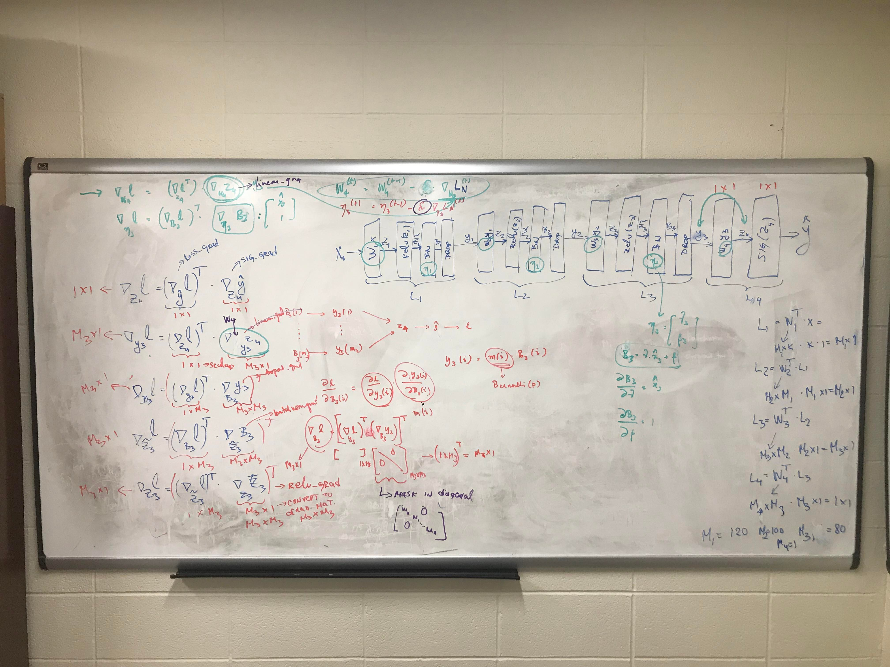
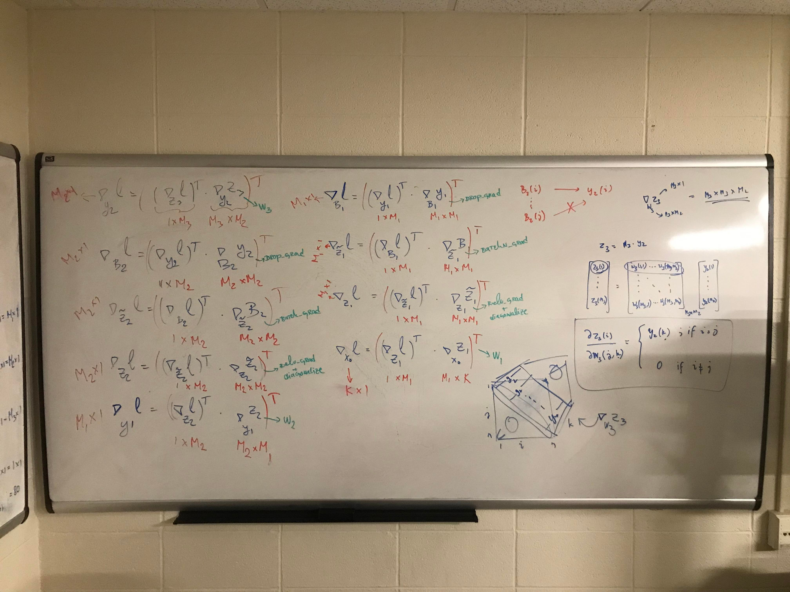

# What is this repo about?

The goal is to create NN1, NN2, and NN4 neural networks in order to predict if a handwritten digit is even or odd.

This implementation uses only `numpy` library for support. No other library used. 

- NN1 and NN2 are plain neural network structures.
- NN4 uses `batchnorm layer` as well as `dropout layer`.

## Implementation
Each models NN1 and NN2 contains layers and W. You can store weights in layers.W or W.

## Code Structure
```shell
├── mlcvlab
│   ├── models # header file of add2 cuda kernel
|   |   ├── base.py
|   |   ├── nn1.py
|   |   ├── nn2.py
|   |   └── nn4.py
|   ├── nn
|   |   ├── activations.py
|   |   ├── basis.py
|   |   ├── batchnorm.py
|   |   ├── dropout.py
|   |   └── losses.py
|   └── optim
|       ├── adam.py
|       ├── async_sgd.py
|       ├── sgd.py
|       └── sync_sgd.py
|    
├── HW1_MNIST_NN1.ipynb
├── HW1_MNIST_NN1.py
├── HW1_MNIST_NN2.ipynb
├── HW1_MNIST_NN2.py
└── README.md
```

# NN4 Backprop Images

Here is how I did the backprop for NN4 with batchnorm and dropout. Code for backprop is based on these formulas.






## Run test cases

# To run the test cases for activations.py file, run the following command and all tests should pass
$python test_activations.py

```
                TEST_SIGMOID_1 : True
                TEST_SIGMOID_2 : True
           TEST_SIGMOID_GRAD_1 : True
           TEST_SIGMOID_GRAD_2 : True
                TEST_SOFTMAX_1 : True
           TEST_SOFTMAX_GRAD_1 : True
                   TEST_TANH_1 : True
              TEST_TANH_GRAD_1 : True
                     TEST_RELU : True
                TEST_RELU_GRAD : True


TEST_ACTIVATIONS : True
```

# To run the test cases for basis.py file, run the following command and all tests should pass
$python test_basis.py

```
                 TEST_LINEAR_1 : True
            TEST_LINEAR_GRAD_1 : True
                 TEST_RADIAL_1 : True
            TEST_RADIAL_GRAD_1 : True


TEST_BASIS : True
```

# To run the test cases for losses.py file, run the following command and all tests should pass
$python test_losses.py

```
                 TEST_L2 : True
                TEST_L2_GRAD_1 : True


TEST_LOSSES : True
```
NOTE: Test cases are to be added for cross entrophy and cross entrophy grad.

